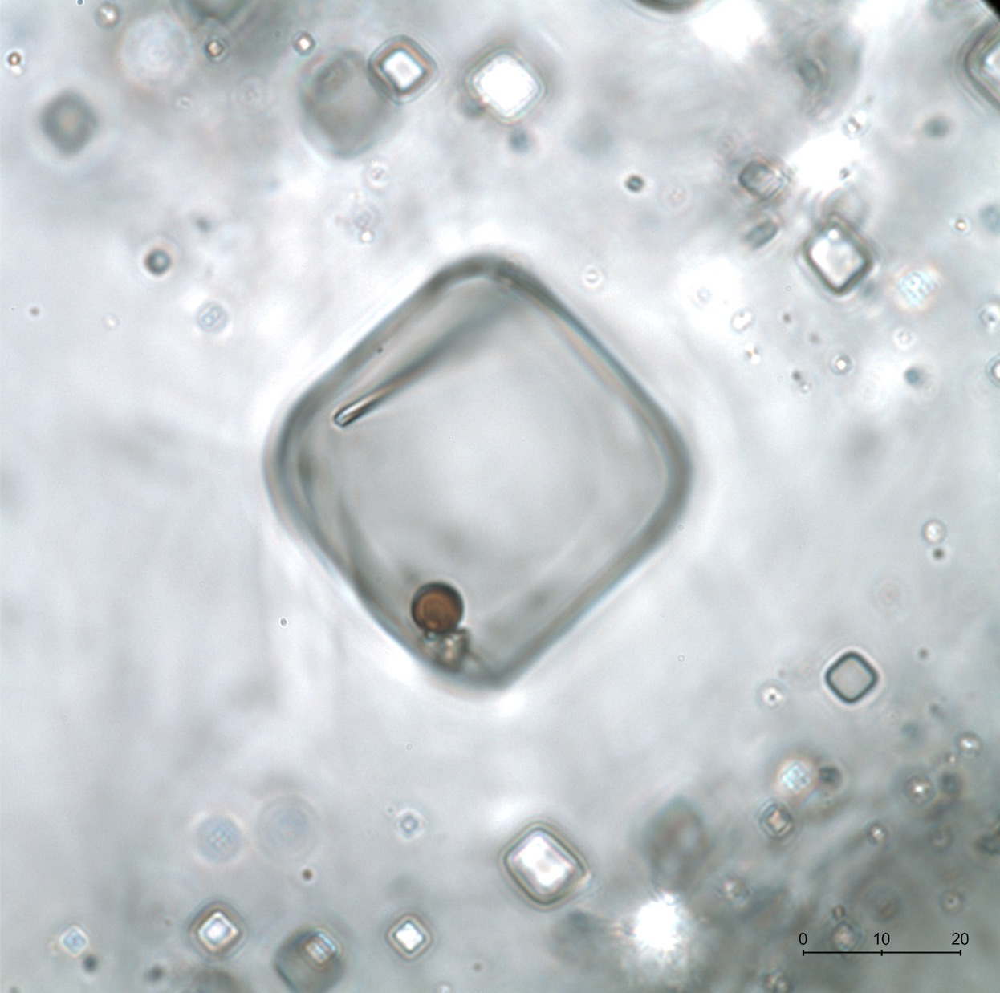
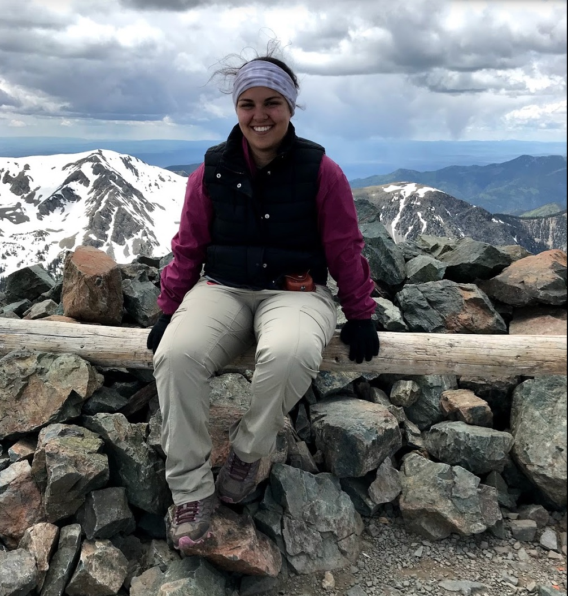

## Homework 0: I made a README.md about myself!
Here I will tell you a little bit about myself and my interests.  

## Sara Schreder-Gomes
___Geology masters student___

----------------------  

#### Interests  
   1) Academic interests
      * Sedimentology
         * Evaporites
         * Fluid Inclusions in Halite 
      * Search for life on Mars
      * My research focuses on microorganisms trapped in fluid inclusions
         * Halite forms from shallow surface water brines. During times of rapid crystallization, microorganisms can become preserved within the halite itself! 
            + Here's a [link](https://www.kathleenbenison.com/red-earth-observatory-lab-group) to our lab group's web page for more information.

  
      
    
   2) Hobbies
      * Knitting
         + *yarn, not files
      * Hand Embroidery
      * Hiking (with my dog, Zoe)
        * Here's a photo from a recent hike I went on in New Mexico- this one without the pup. Snow was abundant above 10,000' into the end of June near Taos. 
 


#### Other Tidbits
Hometown: _North Branch, MN_

Favorite sports teams: _Green Bay Packers_ - __Go PACK Go__, _Minnesota Twins_

Netflix Favorites: _Parks and Recreation_, _The Crown_, and _Grey's Anatomy_

Countries visited: _9..._ and hopefully more to come soon!


#### Code examples 

Even though I have no experience with coding or Github, I'm very excited to learn!

Some `example code`  within a line

And some in a block
```bash
code code code  
code code code code 
code code code
```
